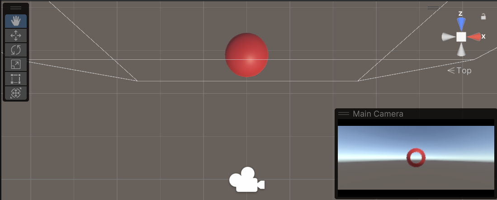
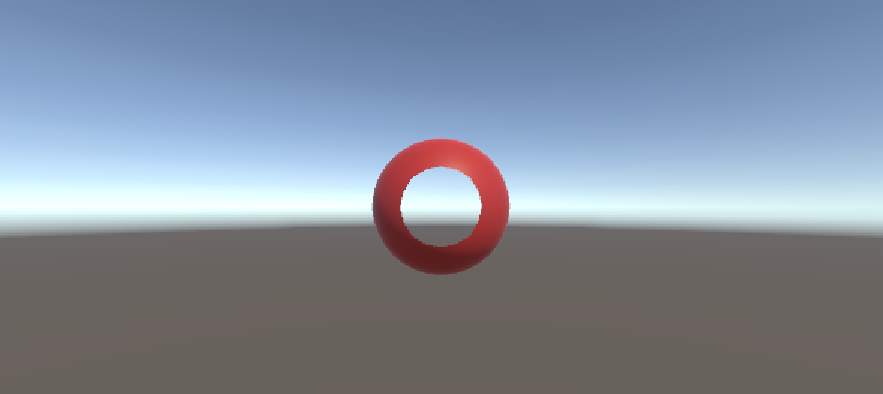
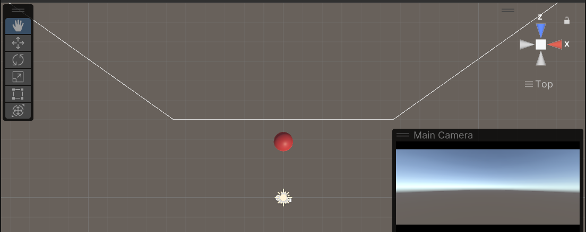
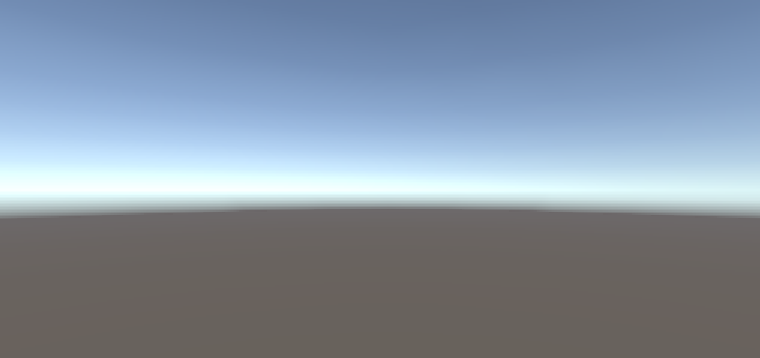

# Seminario Mundos Virtuales
## 1. Qué funciones se pueden usar en los scripts de Unity para llevar a cabo traslaciones, rotaciones y escalados.

Cabe destacar que en Unity, los objetos con Rigidbody no deben modificar su posición ni rotación directamente a través de `Transform.position` o `Transform.rotation`, ya que esto omite la simulación de física y puede generar comportamientos inconsistentes. En su lugar, se utilizan los métodos `rigidbody.MovePosition()` y `rigidbody.MoveRotation()`, que respetan las interacciones físicas. Por otro lado, la escala de un objeto con Rigidbody sí puede modificarse manualmente a través de `Transform.localScale`, pero esto no ajusta automáticamente la masa ni otros parámetros físicos. Para mantener la coherencia en la simulación, es importante ajustar la masa proporcionalmente al cambio de escala, ya que el volumen del objeto y la masa están estrechamente relacionados.

* **Traslación (Movimiento)**
  
  Para mover un objeto, puedes modificar su posición en el espacio 3D. Esto se hace a través de la propiedad `Transform.position` o usando métodos como `Translate`.

  * `transform.position`

    Modifica la posición del objeto directamente:
    
    ```cs
    transform.position = new Vector3(5, 2, 0);
    transform.Translate()
    ```

  * `transform.Translate()`

    Mueve el objeto de acuerdo a un vector de desplazamiento. El desplazamiento puede ser relativo a las coordenadas globales o locales, dependiendo del parámetro usado.

    ```cs
    // Mueve el objeto en dirección de los ejes locales
    transform.Translate(Vector3.forward * 2);  // Mueve 2 unidades hacia adelante
    
    // Mueve el objeto en dirección global
    transform.Translate(Vector3.right * 3, Space.World);  // Mueve 3 unidades a la derecha
    ```

  * `rigidbody.MovePosition()`

    Este método mueve el objeto respetando las leyes de la física, como las colisiones y la gravedad. Es útil cuando deseas mover un objeto sin alterar su comportamiento físico.
    
    ```cs
    // Mueve el objeto a una nueva posición, respetando la simulación física rigidbody.MovePosition(new Vector3(5, 2, 0));
    ```

* **Rotación**
  
  Para rotar un objeto en Unity, se pueden utilizar varios métodos que permiten aplicar una rotación relativa o absoluta, y algunos respetan la simulación física si se trata de objetos con Rigidbody.
  
  * `transform.rotation`

    Modifica la rotación absoluta del objeto en el espacio global utilizando un valor de tipo Quaternion.
    
    ```cs
    // Establece una rotación absoluta para el objeto
    transform.rotation = Quaternion.Euler(0, 90, 0);  // Rota 90 grados en el eje Y
    ```

  * `Transform.Rotate()`
    
    Aplica una rotación relativa al objeto, sumando la rotación especificada a la actual.
    
    ```cs
    // Rota el objeto localmente (en el espacio del objeto)
    transform.Rotate(Vector3.up * 45 * Time.deltaTime);  // Rota 45 grados por segundo en el eje Y
    ```

  * `rigidbody.MoveRotation()`

    Este método mueve la rotación de un objeto con Rigidbody respetando las leyes de la física, como colisiones o fuerzas externas. Es útil cuando no deseas modificar la rotación directamente pero quieres que el Rigidbody lo maneje.
    
    ```cs
    // Rota el objeto respetando la física (por ejemplo, en respuesta a una fuerza)
    rigidbody.MoveRotation(Quaternion.Euler(0, 90, 0));  // Rota el objeto a 90 grados en el eje Y
    ```

* **Escalado**

  El escalado de un objeto en Unity se realiza a través de la propiedad Transform.localScale. Sin embargo, es importante tener en cuenta que el escalado de un objeto con Rigidbody no afectará a la masa o la forma física automáticamente. Si el objeto es 
  escalado, la masa debería ajustarse manualmente, ya que el volumen de un objeto es proporcional al cubo de su escala.

  * `transform.localScale`

    Modifica el tamaño del objeto de manera absoluta. Este valor es un Vector3 que indica el factor de escala en cada uno de los ejes (X, Y, Z).
    
    ```cs
    // Establece un nuevo tamaño para el objeto
    transform.localScale = new Vector3(2, 2, 2);  // Escala el objeto al doble de su tamaño original
    ```

  * **Escalado relativo con** `Transform.localScale`
    
    También puedes aplicar una escala relativa multiplicando el valor de localScale por un factor.
    
    ```cs
    // Escala el objeto por un factor relativo
    transform.localScale *= 1.5f;  // Aumenta el tamaño del objeto en un 50%
    ```

  * **Ajuste de la masa al escalar un objeto con Rigidbody**

    Cuando se escala un objeto con Rigidbody, es necesario ajustar la masa proporcionalmente al cambio de volumen. La masa de un objeto escalado es proporcional al cubo del factor de escala.
    
    ```cs
    // Escala el objeto y ajusta la masa en consecuencia
    float escalaFactor = 2f;  // Escalar al doble
    transform.localScale = new Vector3(escalaFactor, escalaFactor, escalaFactor);
    
    // Ajusta la masa del Rigidbody (aproximadamente proporcional al volumen)
    rigidbody.mass *= Mathf.Pow(escalaFactor, 3);  // Escalar la masa proporcionalmente al volumen
    ```
     
---

## 2. Como trasladarías la cámara 2 metros en cada uno de los ejes y luego la rotas 30º alrededor del eje Y?. Rota la cámara alrededor del eje Y 30ª y desplázala 2 metros en cada uno de los ejes. ¿Obtendrías el mismo resultado en ambos casos?. Justifica el resultado

En Unity, las operaciones de traslación y rotación no son conmutativas, lo que significa que el orden en el que realizamos estas operaciones afectará el resultado final.

1.- **Primero trasladamos la cámara 2 metros en cada uno de los ejes y luego la rotamos 30º alrededor del eje Y**:
 
  * **Traslación**: Movemos la cámara 2 metros en los ejes X, Y y Z. Teniendo en cuenta que la posición inicial de la cámara es (0,0,0). Después de la traslación, la posición es (2,2,2).
  * **Rotación**: Luego, rotamos la cámara 30º alrededor del eje Y. Esta rotación se aplica en la nueva posición de la cámara. La cámara girará en torno a su propia posición actual (2,2,2) en relación al eje Y.

2.- **Primero rotamos la cámara 30º alrededor del eje Y y luego la desplazamos 2 metros en cada uno de los ejes**:

 * **Rotación**: Con la cámara en la posición (0,0,0), la rotamos 30º alrededor del eje Y, la cámara girará en torno a ese punto de origen.
 * **Traslación**: Después de la rotación, trasladamos la cámara 2 metros en los ejes X, Y y Z. El resultado de esta traslación depende de la nueva orientación de la cámara después de la rotación.
    
Debido a la naturaleza no conmutativa de estas operaciones, **no** obtenemos el mismo resultado en ambos casos. La posición y orientación finales de la cámara serán diferentes porque la traslación y la rotación alteran la posición de referencia y el eje de rotación.

---

## 3. Sitúa la esfera de radio 1 en el campo de visión de la cámara y configura un volumen de vista que la recorte parcialmente.

#### Configuración
Para lograr que la esfera se recorte parcialmente simplemente, desde el `inspector` de la `cámara`, se ajustan los valores de `Clipping Planes`:
* `Near`: **Distancia mínima** desde la cámara a la cual los objetos son visibles.
* `Far`: **Distancia máxima** desde la cámara a la cual los objetos son visibles.

En este caso, se ajustó el valor de `Near` para que recortara justo la parte de la esfera que se encuentra a esa distancia.


#### Vista en Escena


#### Vista en Game


---

## 4. Sitúa la esfera de radio 1 en el campo de visión de la cámara y configura el volumen de vista para que la deje fuera de la vista.

#### Configuración
Para lograr que la esfera se recorte parcialmente simplemente, desde el `inspector` de la `cámara`, se ajustan los valores de `Clipping Planes`:
* `Near`: **Distancia mínima** desde la cámara a la cual los objetos son visibles.
* `Far`: **Distancia máxima** desde la cámara a la cual los objetos son visibles.

En este caso, se ajustó el valor de `Near` para que se pasara de la posición de la esfera, haciéndo que ya no sea visible.


#### Vista en Escena


#### Vista en Game


---

## 5. Como puedes aumentar el ángulo de la cámara. Qué efecto tiene disminuir el ángulo de la cámara.

1.- **Cómo aumentar el ángulo de la cámara**:

  * Ve al inspector de la cámara.
  * Encuentra la propiedad llamada "Field of View".
  * Incrementa el valor de esta propiedad.

Al aumentar el ángulo de visión, estás ampliando el campo de visión de la cámara, lo que permite ver una porción más grande del escenario.

2.- **Efecto de disminuir el ángulo de la cámara**:

  * Ve al inspector de la cámara.
  * Encuentra la propiedad "Field of View".
  * Reduce el valor de esta propiedad.
    
Al disminuir el ángulo de visión, estás reduciendo el campo de visión de la cámara, lo que hace que la escena se vea más estrecha y más "acercada".

---

## 6. Es correcta la siguiente afirmación: Para realizar la proyección al espacio 2D, en el inspector de la cámara, cambiaremos el valor de projection, asignándole el valor de orthographic

Si, la afirmación es correcta. Para proyectar en espacio 2D en Unity, debemos ir al inspector de la cámara y cambiar el valor de la propiedad "Projection" a "Orthographic". Esto ajusta la proyección de perspectiva (3D) a ortográfica (2D), ideal para juegos 2D.

---

## 7. Especifica las rotaciones que se han indicado en los ejercicios previos con la utilidad quaternion.


---

## 8. ¿Como puedes averiguar la matriz de proyección en perspectiva que se ha usado para proyectar la escena al último frame renderizado?.

Para averiguar la matriz de proyección en perspectiva utilizada para proyectar la escena al último frame renderizado, podemos acceder a la matriz directamente desde la cámara a través de un script en c#.

```cs
public class ProyeccionMatriz : MonoBehaviour { 
  void Start() { 
    // Obtenemos la cámara principal 
    Camera cam = Camera.main; 
    // Verificamos si la cámara existe
    if (cam != null) { 
      // Obtenemos la matriz de proyección de la cámara
      Matrix4x4 projectionMatrix = cam.projectionMatrix;
      // Imprimimos la matriz de proyección en la consola
      Debug.Log("Matriz de Proyección:\n" + projectionMatrix);
     }
   }
 }
```

---

## 9. ¿Como puedes averiguar la matriz de proyección en perspectiva ortográfica que se ha usado para proyectar la escena al último frame renderizado?.

Para averiguar la matriz de proyección en perspectiva ortográfica utilizada para proyectar la escena al último frame renderizado, podemos acceder a ella desde la cámara a través del siguiente script:

```cs
public class OrthographicProjectionMatrix : MonoBehaviour {
  void Start() { 
    Camera camera = Camera.main;
    if (camera != null) { 
      if (camera.orthographic) {
        // Obtener la matriz de proyección ortográfica de la cámara
        Matrix4x4 orthoProjectionMatrix = camera.projectionMatrix;
        Debug.Log("Matriz de proyección ortográfica: " + orthoProjectionMatrix);
      } else { 
        Debug.LogWarning("La cámara no está en modo ortográfico.");
      } 
    } else {
      Debug.LogError("No se encontró la cámara principal.");
    }
  }
}
```

---

## 10. ¿Cómo puedes obtener la matriz de transformación entre el sistema de coordenadas local y el mundial?.

En Unity, para obtener la matriz de transformación que convierte las coordenadas locales de un objeto en las coordenadas del sistema global (mundial), puedes utilizar la propiedad `Transform.localToWorldMatrix`. Esta propiedad devuelve una matriz de 4x4 que te permite convertir las posiciones, rotaciones y escalas locales del objeto en coordenadas globales.

La matriz de transformación `localToWorldMatrix` de un objeto transforma puntos, direcciones y vectores del sistema de coordenadas local del objeto al sistema de coordenadas global (o mundial). Esto incluye no sólo la traslación (posición), sino también la rotación y el escalado.

```cs
// Obtenemos la matriz de transformación del objeto
Matrix4x4 matrix = transform.localToWorldMatrix;

// Ahora, podemos usar esta matriz para convertir un punto local a un punto mundial
Vector3 puntoLocal = new Vector3(1, 1, 1);  // Punto en el espacio local del objeto
Vector3 puntoMundial = matrix.MultiplyPoint(puntoLocal);  // Convierte el punto a coordenadas globales

Debug.Log("Punto mundial: " + puntoMundial);
```

  - **`transform.localToWorldMatrix`**: Obtiene la matriz de transformación que mapea las coordenadas locales del objeto a las coordenadas globales. La matriz de 4x4 incluye la posición, la rotación y la escala del objeto en el espacio mundial.
  - **`matrix.MultiplyPoint(puntoLocal)`**: La función `MultiplyPoint()` aplica la matriz de transformación a un punto en el espacio local para obtener la posición correspondiente en el espacio global. Si usas `MultiplyVector()`, obtendrás la transformación de vectores, es decir, sin considerar la traslación, solo rotación y escala.

---

## 11. Cómo puedes obtener la matriz para cambiar al sistema de referencia de vista

Para obtener la matriz que cambia al sistema de referencia de vista, debemos utilizar la matriz de transformación de la cámara. Esta matriz nos permite convertir coordenadas del mundo a coordenadas de la cámara. Gracias a este script podemos conseguirla:

```cs
public class ViewMatrixExample : MonoBehaviour {
  void Start() { 
    Camera camera = Camera.main;
    if (camera != null) {
      // Obtener la matriz de vista de la cámara
      Matrix4x4 viewMatrix = camera.worldToCameraMatrix;
      Debug.Log("Matriz de vista: " + viewMatrix); 
    } else {
      Debug.LogError("No se encontró la cámara principal.");
    }
  }
}
```

Esta matriz transforma las coordenadas desde el sistema de referencia del mundo al sistema de referencia de la cámara.

---

## 12. Especifica la matriz de la proyección usado en un instante de la ejecución del ejercicio 1 de la práctica 1.

---

## 13. Especifica la matriz de modelo y vista de la escena del ejercicio 1 de la práctica 1.

---

## 14. Aplica una rotación en el start de uno de los objetos de la escena y muestra la matriz de cambio al sistema de referencias mundial.

---

## 15. ¿Como puedes calcular las coordenadas del sistema de referencia de un objeto con las siguientes propiedades del Transform:?: Position (3, 1, 1), Rotation (45, 0, 45)

Para calcular las coordenadas de un punto en el sistema de referencia local de un objeto en Unity, dadas las propiedades de Posición y Rotación, puedes usar la propiedad worldToLocalMatrix del Transform. Esta matriz convierte las coordenadas globales (mundiales) a locales, considerando la posición, rotación y escala del objeto.

```cs
using UnityEngine;

public class LocalCoordinates : MonoBehaviour
{
    void Start()
    {
        // Define global position and rotation
        transform.position = new Vector3(3, 1, 1);
        transform.rotation = Quaternion.Euler(45, 0, 45);

        // Convert a global point to local
        Vector3 worldPoint = new Vector3(3, 1, 1);
        Vector3 localPoint = transform.worldToLocalMatrix.MultiplyPoint(worldPoint);

        Debug.Log("Point in local coordinates: " + localPoint);
    }
}

```

  - **`worldToLocalMatrix`**: Convierte las coordenadas de un punto en el espacio global a las coordenadas locales del objeto.
  - **`MultiplyPoint()`**: Aplica la matriz de transformación a un punto para obtener su ubicación en el sistema de coordenadas local.

Este método tiene en cuenta la posición y rotación del objeto para realizar la conversión correctamente.
